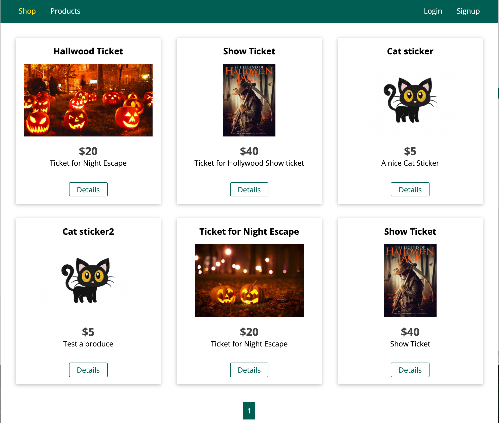

# Online-Shop-App

## 1.High-level Discription

Developed an MVC E-Commerce web app, including products management, shopping cart, check-out, and payment

## 2. What did in this project

- Developed an MVC E-Commerce web app, including products management, shopping cart, check-out, and payment
- Constructed Restful APIs in back-end server by Node.js and MongoDB/MySQL
- Implemented the views by using EJS templating language
- Used JWT and cookie/session to handle user authentication and authorization
- Utilized Multer to support File Upload functionality
- PDFKit is used to generate Invoice and Integrated with Stripe API to handle payments
- Apply node-mailer to send emails for sign up and change password
- Used bcrypt.js to store passwords and password comparison
- Csurf is used to prevents the Cross-Site Request Forgery(CSRF) attack on the application

## 3. App Screenshot

    
 
 
 
 

